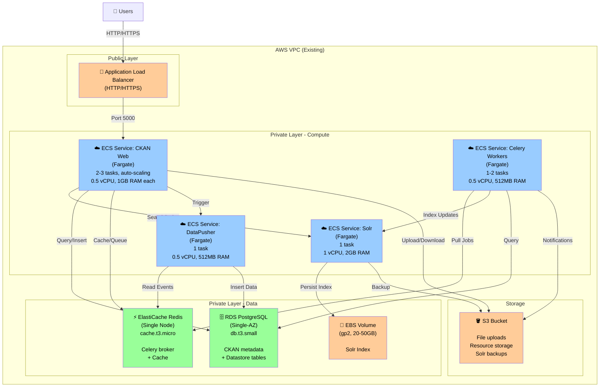

```mermaid
graph TB
    Users["👥 Users"]

    subgraph "AWS VPC (Existing)"
        subgraph "Public Layer"
            ALB["🔗 Application Load Balancer<br/>(HTTP/HTTPS)"]
        end

        subgraph "Private Layer - Compute"
            ECS_CKAN["☁️ ECS Service: CKAN Web<br/>(Fargate)<br/>2-3 tasks, auto-scaling<br/>0.5 vCPU, 1GB RAM each"]
            ECS_Celery["☁️ ECS Service: Celery Workers<br/>(Fargate)<br/>1-2 tasks<br/>0.5 vCPU, 512MB RAM"]
            ECS_DataPusher["☁️ ECS Service: DataPusher<br/>(Fargate)<br/>1 task<br/>0.5 vCPU, 512MB RAM"]
            ECS_Solr["☁️ ECS Service: Solr<br/>(Fargate)<br/>1 task<br/>1 vCPU, 2GB RAM"]
        end

        subgraph "Private Layer - Data"
            RDS["🗄️ RDS PostgreSQL<br/>(Single-AZ)<br/>db.t3.small<br/><br/>CKAN metadata<br/>+ Datastore tables"]
            Redis["⚡ ElastiCache Redis<br/>(Single Node)<br/>cache.t3.micro<br/><br/>Celery broker<br/>+ Cache"]
            EBS["💾 EBS Volume<br/>(gp2, 20-50GB)<br/><br/>Solr Index"]
        end

        subgraph "Storage"
            S3["🪣 S3 Bucket<br/><br/>File uploads<br/>Resource storage<br/>Solr backups"]
        end
    end

    Users -->|HTTP/HTTPS| ALB
    ALB -->|Port 5000| ECS_CKAN

    ECS_CKAN -->|Search/Index| ECS_Solr
    ECS_CKAN -->|Query/Insert| RDS
    ECS_CKAN -->|Cache/Queue| Redis
    ECS_CKAN -->|Trigger| ECS_DataPusher
    ECS_CKAN -->|Upload/Download| S3

    ECS_DataPusher -->|Read Events| Redis
    ECS_DataPusher -->|Insert Data| RDS

    ECS_Celery -->|Pull Jobs| Redis
    ECS_Celery -->|Index Updates| ECS_Solr
    ECS_Celery -->|Query| RDS
    ECS_Celery -->|Notifications| S3

    ECS_Solr -->|Persist Index| EBS
    ECS_Solr -->|Backup| S3

    style ALB fill:#ffcc99,color:#000000
    style ECS_CKAN fill:#99ccff,color:#000000
    style ECS_Celery fill:#99ccff,color:#000000
    style ECS_DataPusher fill:#99ccff,color:#000000
    style ECS_Solr fill:#99ccff,color:#000000
    style RDS fill:#99ff99,color:#000000
    style Redis fill:#99ff99,color:#000000
    style EBS fill:#ffcc99,color:#000000
    style S3 fill:#ffcc99,color:#000000
```
